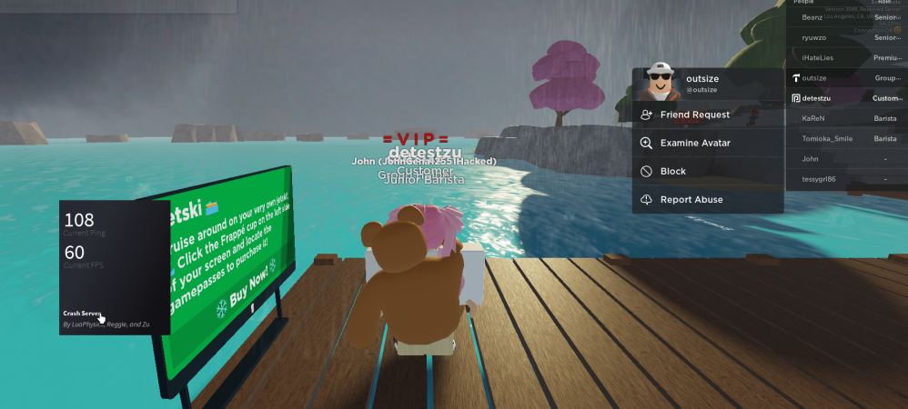

<h1>FLM Deluxe</h1>

Free & Open Source Crash Bot for Roblox, the name stemming from an old inside joke project, "Frappe Lag Machine".

<h2>License</h2>

This software, and it's associated files/documents, are protected by the General Public License v3, see <a href="LICENSE.txt">LICENSE.txt</a> for more information Copyright (C) 2022 Latte Softworks, all rights reserved.

<h2>Special Note</h1>

While I (<a href="https://v3rmillion.net/member.php?action=profile&uid=1763716">reggie</a>) orignally came up and theorized about some of this method, we definately couldn't have done this without each-other! The bot/self-bot (proprietary) and extensions (The Lua code in this repo too) were "re"written by <a href="https://v3rmillion.net/member.php?action=profile&uid=1149709">LuaPhysics</a>. <a href="https://v3rmillion.net/member.php?action=profile&uid=2719846">Zu</a> also greatly helped with this operation/project, and even made a little GUI for messing with everyone! (Keeping that proprietary too ;))

<h2>Use/Installation</h2>

This entire open sourced project was part of another, bigger project we're keeping proprietary. You will <i>mostly</i> be on your own with modification and what-not, but here is some basic instruction:

<ul>
    <li><a href="http://github.com/latte-soft/flm/zipball/master">Download this repository as a .zip file</a>, or just use <code>git clone</code> if you have and are familiar with git.</li>
    <li>Copy <code>flm_init.lua</code> into Synapse's <code>autoexec</code> folder.</li>
    <li>Copy the <code>flm</code> folder into Synapse's <code>workspace</code> folder.</li>
</ul>

Afterwards, you should just be able to join any game and watch the "magic" happen!

<h2>Image Catalogue!</h2>

Here, you'll see some "important" or relative images from the past with this, some even funny too..

O_O (i was literally messing around with shit, lmao we all know this isnt the whole thing)

 

Here's the bot/selfbot LuaPhysics wrote for just Discord implementation!

 

Never gets old!! (ily va1kio!!! <3333)

